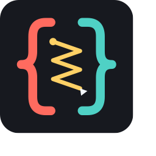

# SyntaxStitch

<p align="center"></p>

**Tired of AI breaking your code and wasting more tokens trying to fix mismatched closing glyphs? SyntaxStitch is for you.**

SyntaxStitch watches structural edits and repairs orphaned brackets, quotes, tags, and Python indentation before one missing boundary turns the rest of the file into syntax-error confetti. It works with AI edits, paste replacements, multi-cursor changes, and ordinary typing.

Behind the scenes, SyntaxStitch maintains a UUID-backed shadow index of paired boundaries. If an edit destroys exactly one side, it checks whether the surviving side has legitimately rebound to another boundary. Only genuinely orphaned structures are healed.

No cloud service. No source upload. No configuration required.

## Supported Structures

| Structure | Examples | Behavior |
| --- | --- | --- |
| Brackets | `()`, `[]`, `{}` | Restores one deleted side when its indexed partner would otherwise be orphaned. Deletes the whole pair when its interior is only whitespace. |
| Quotes | `'...'`, `"..."`, `` `...` ``, `'''...'''`, `"""..."""` | Restores one deleted quote without treating quoted braces or tags as structure. Includes HTML attribute quotes and JavaScript template literals. |
| Markup tags | `<section>...</section>` | Restores an orphaned boundary, or deletes both tags when their interior is only whitespace. |
| Python indentation | Indent and dedent boundaries | Tracks block boundaries and repairs an orphaned side. |
| Closing-brace indentation | Line-leading `}` | Realigns a changed closer with its matched opening brace. |

SyntaxStitch is enabled by default for JavaScript, TypeScript, JSON, HTML, XML, Vue, Svelte, Astro, CSS, SCSS, Less, Python, C#, Java, Go, and Rust. Language coverage can be changed with `syntaxstitch.languages`.

## Features

- UUID-backed, language-scoped structural pairs for braces, quotes, tags, and Python indentation boundaries.
- Embedded-language transitions for JavaScript in `<script>`, CSS in `<style>`, and HTML inside JavaScript template literals and JSX/TSX.
- Descending batch analysis so lower-file changes do not invalidate earlier offsets.
- Exact token restoration for one-sided brace and tag deletion.
- Guarded repair edits that cannot recursively trigger more repairs.
- JSON Lines records in the **SyntaxStitch** output channel for agent/tool synchronization.
- Persistent workspace repair statistics split into `[square]`, `(parenthesis)`, `{curly}`, `<tag>`, `"quote"`, and `t indentation` counters.
- Accessible status-bar control showing state and total repairs; click it for toggle, statistics, reset, output, and reindex actions.
- Inline pair actions such as `← internal static int CalculateTotal(...) · L12–L28 · 17 lines` after closing boundaries without modifying source files. Modifier-click the owner to select the exact structural pair, the start line to jump to its opening symbol, or the line count to select every complete line in the block.
- Localized closing-brace indentation repair based on the matched opening brace.
- Context-aware Structural Tab navigation through closing tags and across correctly indented line-leading `}` boundaries.

## Why SyntaxStitch?

A single missing `)`, `]`, `}`, closing tag, or dedent can collapse syntax highlighting and make the next AI edit reason from broken code. SyntaxStitch keeps the buffer structurally coherent while preserving deliberate edits, including deleting redundant boundaries.

It is a guardrail, not a formatter or compiler replacement. Your existing language server remains the authority for language semantics.

### Edit Intent

SyntaxStitch distinguishes an accidental one-sided edit from a deliberate structural edit. It uses the indexed pair, the resulting document, the edit shape, and direct keyboard intent rather than blindly replacing every missing token.

| Edit | Response | Why |
| --- | --- | --- |
| Delete one side of a whitespace-only `()`, `[]`, `{}`, quote, or paired tag | Remove the surviving boundary and interior whitespace. | Empty concrete pairs behave as one atomic unit; restoring them would fight ordinary cleanup. |
| Delete one side of a pair containing code, comments, or text | Restore the missing boundary. | Meaningful content still needs its structural owner. Comments count as meaningful content. |
| Backspace/Delete a meaningful closing boundary directly | Restore it and select the complete pair, such as `{ ... }`, `(x, y)`, or `<p>...</p>`. | Selection makes the protected ownership visible and gives the next edit an explicit whole-structure target. |
| Delete part of a multi-character boundary such as the `>` in `</p>` | Replace the surviving `</p` fragment with exactly one complete `</p>`. | Replacing the damaged token in place avoids duplicating a full tag behind its surviving fragment. |
| An HTML provider inserts adjacent `<p></p>` and leaves the cursor after `</p>` | Move the cursor between `<p>` and `</p>`. | The provider owns tag generation; SyntaxStitch only corrects the short-lived caret position so typing can continue inside the element. |
| Press Tab immediately before an indexed closing tag | Jump to the next closing tag, such as from `</h1>` to `</p>`. | Closing tags form a useful outward path through nested markup. |
| Press Tab immediately before a correctly indented line-leading `}` | Jump just past the `}`. | The block is already aligned, so adding more indentation is less useful than crossing its structural boundary. A misindented `}` keeps normal Tab behavior. |
| Backspace/Delete the outer boundary in adjacent closers such as `add(x))` | Restore it and move the caret one boundary inward. | Stepping inward avoids trapping the caret outside a nested closer chain. Reaching a meaningful inner pair selects that pair. |
| Repeatedly delete nested empty pairs | Remove one layer per attempt and leave the caret at the next boundary. | One layer preserves predictable keyboard intent without collapsing unrelated nesting. |
| Select and remove both boundaries together | Allow the edit. | A complete-pair edit is explicit intent to remove or unwrap that structure. |
| Paste, AI, or multi-cursor edit both boundaries together | Allow the coordinated edit. | Batch edits that supply or remove both sides should not be undone token by token. |
| Replace a boundary with an equivalent token or tag | Keep the replacement without adding another boundary. | The resulting structure is already balanced. |
| Remove a closer when a genuinely spare later closer can take ownership | Allow rebinding only when the scoped pair count is preserved. | This repairs ownership in malformed code without stealing a closer from an enclosing pair. |
| Programmatically delete a protected multiline closer | Restore it while compacting one trailing line break per attempt. | Non-interactive edits have no caret intent; gradual compaction preserves structure while honoring movement toward the content. |

Direct selection and caret movement apply only to empty, single-cursor Backspace/Delete operations. Selections, multi-cursor edits, paste, and AI/workspace edits keep their batch semantics.

SyntaxStitch does not independently auto-close a newly typed HTML tag. VS Code's HTML service, Emmet, or another language provider may create the closing tag. SyntaxStitch recognizes a newly inserted adjacent empty pair and corrects a cursor left after its closer; the pending correction is document-version-bound and expires after 500 ms.

### Language Ownership

Every shadow pair records its active language. HTML tags remain in HTML, `<script>` bodies shift to JavaScript, `<style>` bodies shift to CSS, and JavaScript template markup or JSX/TSX shifts back to HTML. Quotes and comments suppress structural decoys in their own context. Language ownership is also checked during post-edit rebinding, so a JavaScript closer cannot silently adopt an HTML or CSS boundary.

### Structural Selection

**Select Matching Structure** selects the pair at either boundary and expands through enclosing pairs. On macOS, `Cmd+PageUp` expands and `Cmd+PageDown` retraces the exact prior selections. Without history, Page Down contracts toward the selection's active edge. This history is intentional: in sibling-heavy blocks, geometric inference alone cannot know which child the user came from.

When a single empty cursor is immediately before a closing tag, Tab moves to the next closing tag in document order. Before a line-leading `}`, it jumps past the boundary only when the closing line's indentation exactly matches the indexed opening line. Otherwise, Tab retains its normal indentation behavior.

SyntaxStitch yields Tab to VS Code while a snippet, suggestion, inline suggestion, read-only editor, or Tab-moves-focus mode is active. Outside a recognized structural boundary, the command delegates directly to VS Code's normal Tab command.

## Installation

Install **SyntaxStitch** from the VS Code Marketplace, or download the `.vsix` attached to a [GitHub Release](https://github.com/neonash7777/SyntaxStitch/releases) and run **Extensions: Install from VSIX...**.

SyntaxStitch requires VS Code 1.127.0 or later.

## Support SyntaxStitch

If SyntaxStitch saves you time, you can support its development through [Venmo @neonash7777](https://venmo.com/u/neonash7777) or [Cash App $neonash7777](https://cash.app/$neonash7777).

## Commands

- **SyntaxStitch: Select Matching Structure** selects the complete pair at the cursor, including both boundaries and its content. Run it again to expand outward. The default shortcuts are `Ctrl+Alt+Shift+S` and, on macOS, `Cmd+PageUp`. They can be changed in **Preferences: Open Keyboard Shortcuts**.
- **SyntaxStitch: Select Inner Structure** retraces selections made with **Select Matching Structure**, restoring the exact previous section. Otherwise, it contracts to the nearest nested pair and follows the selection's active edge when siblings exist. On macOS, use `Cmd+PageDown`.
- **SyntaxStitch: Structural Tab** moves from one closing tag to the next or crosses a correctly indented line-leading `}`. Tab invokes it only when editor contexts such as snippets and suggestions do not own Tab.
- **SyntaxStitch: Toggle On/Off** changes the workspace setting, or the global setting when no workspace is open.
- **SyntaxStitch: Show Repair Statistics** displays total and per-structure repair counts.
- **SyntaxStitch: Reset Repair Count** clears the persisted count.
- **SyntaxStitch: Configure Pair Labels** chooses `off`, `active`, or `all`; `all` omits inline pairs and labels multiline line-leading closers only. Labels use VS Code inlay hints, follow the editor's inlay-hint visibility setting, and use its link-modifier gesture because VS Code reserves plain clicks for caret placement.
- **SyntaxStitch: Rebuild Shadow Index** reindexes the active document.
- **SyntaxStitch: Show Reconciliation Output** opens the structured repair log.

## Settings

- `syntaxstitch.enabled` enables automatic reconciliation.
- `syntaxstitch.pairLabels` displays virtual opening-declaration labels at matching closing braces and tags. It defaults to `all` for multiline boundaries.
- `syntaxstitch.fixClosingIndentation` aligns changed line-leading `}` tokens with their matched `{`. It defaults to `true`.
- `syntaxstitch.structures` selects `brace`, `quote`, `tag`, and/or `indent` repairs. All are enabled by default.
- `syntaxstitch.languages` limits monitoring to selected VS Code language identifiers. Set it to `[]` to monitor every language.
- `syntaxstitch.maxFileSizeKB` skips large documents. The default is 2048 KB.
- `syntaxstitch.logLevel` controls structured output with `off`, `repairs`, or `verbose`.
- `syntaxstitch.repairCountCooldownMs` prevents immediate retries on the same boundary from inflating statistics. It defaults to 5000 ms; use `0` to count every application.

## Development

```sh
npm run compile
npm test
```

Open **Run and Debug** and use the green Run button with either persistent launch action:

- **Run SyntaxStitch Extension** opens this project in an Extension Development Host.
- **Run SyntaxStitch: Manual Test Lab (No Debugger)** opens the fixture folder ready for fault injection without attaching Node's inspector.

The host remains open until you stop debugging. `npm test` is intentionally different: it runs automated tests in a disposable host and closes it when they finish.

For an AI-driven fault-injection walkthrough covering HTML, JavaScript, Python, and C#, see [manual-tests/AI_TEST_PROMPT.md](manual-tests/AI_TEST_PROMPT.md).

Release maintainers should follow [PUBLISHING.md](PUBLISHING.md).

## Versioning

SyntaxStitch follows [Semantic Versioning](https://semver.org/):

- Patch releases fix behavior without intentionally changing configuration or compatibility.
- Minor releases add backward-compatible capabilities or settings.
- Major releases may change existing behavior, settings, or compatibility requirements.

While the version is below `1.0.0`, minor releases may still refine behavior based on real-world editing workflows. See [CHANGELOG.md](CHANGELOG.md) for release details.

## Privacy

SyntaxStitch runs entirely inside the VS Code Extension Host. It does not transmit source code, telemetry, repair statistics, or configuration to an external service. Repair statistics stay in VS Code workspace storage, and structured reconciliation records stay in the local **SyntaxStitch** output channel.

## Limitations

The stable VS Code extension API does not expose a hook that can block or mutate edits before language services observe them, nor can an extension inject an actual system message into an upstream AI agent. SyntaxStitch therefore performs the earliest supported guarded repair from `workspace.onDidChangeTextDocument` and emits a machine-readable synchronization record to its output channel.

SyntaxStitch protects indexed structural pairs with a lightweight context-aware scanner; it is not a full language parser, formatter, linter, or substitute for source control. Embedded language detection currently covers script/style blocks, JavaScript template markup, and JSX/TSX. Review repaired edits just as you would review edits from any other coding tool.
